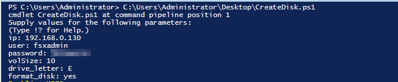
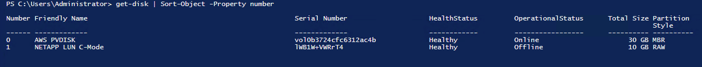
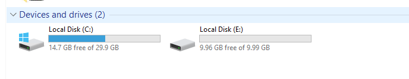

# :warning: **NOTICE:**

This repository is no longer being maintained. However, all the code found here has been relocated to a new NetApp managed GitHub repository found here [https://github.com/NetApp/FSx-ONTAP-utils/tree/main/Samples/Management-Utilities/iSCSI-Vol-Create-and-Mount](https://github.com/NetApp/FSx-ONTAP-utils/tree/main/Samples/Management-Utilities/iSCSI-Vol-Create-and-Mount) where it is continually updated. Please refer to that repository for the latest updates.

# Mount FSxN ISCSI volume on EC2 windows
Powershell automation for creation FSxN ISCSI volume and mount it on ec2 instance.

### Prerequisites
* Connection between FSxN and ec2 windows.
* TCP ports should be open between the ec2 windows and the FSxN: 
    `22`,
    `443`,
    `3260`
## Deployment
There are two PowerShell scripts:

```text
  1. Preinstall.ps1 - It installs ONTAP PowerShell and Multiple-IO if they haven't been installed. (no user input needed)
  2. CreateDisk.ps1 - It creates volume, lun, igroup and mapped to the server. 
```
## User Input

Parameter | Description | 
--- | --- | 
IP | FSxN filesystem management IP |
User | Fsxadmin user or user with lun and volume creation privileges | 
Password | User Password |
Vol_size | Disk size (GB) |
Drive_letter | Drive letter to map the disk |
Format_disk | (Boolean – Yes or no) – The user can choose whether to create a partition and format the disk. |

## Installation
 There are two ways to run the scripts and set the params:

```text
  1. in PowerShell ISE 
  2. CMD command: .\createDisk.ps1  <ip> <user> <password> <vol_size> <drive_letter> <formatdisk>
```
    
## Notes
  1.  Reboot is required for the Multiple-IO module - The instance will be restarted automatically once the Preinstall script is complete
  2. On each run, the script creates only one disk
  3. Every step in the script has an error handling component, so if a step fails, the script will stop and print the error message.
## Screenshots






## Author Information

This repository is maintained by the contributors listed on [GitHub](https://github.com/NetApp/FSx-ONTAP-samples-scripts/graphs/contributors).

## License

Licensed under the Apache License, Version 2.0 (the "License").

You may obtain a copy of the License at [apache.org/licenses/LICENSE-2.0](http://www.apache.org/licenses/LICENSE-2.0).

Unless required by applicable law or agreed to in writing, software distributed under the License is distributed on an _"AS IS"_ basis, without WARRANTIES or conditions of any kind, either express or implied.

See the License for the specific language governing permissions and limitations under the License.

© 2024 NetApp, Inc. All Rights Reserved.
