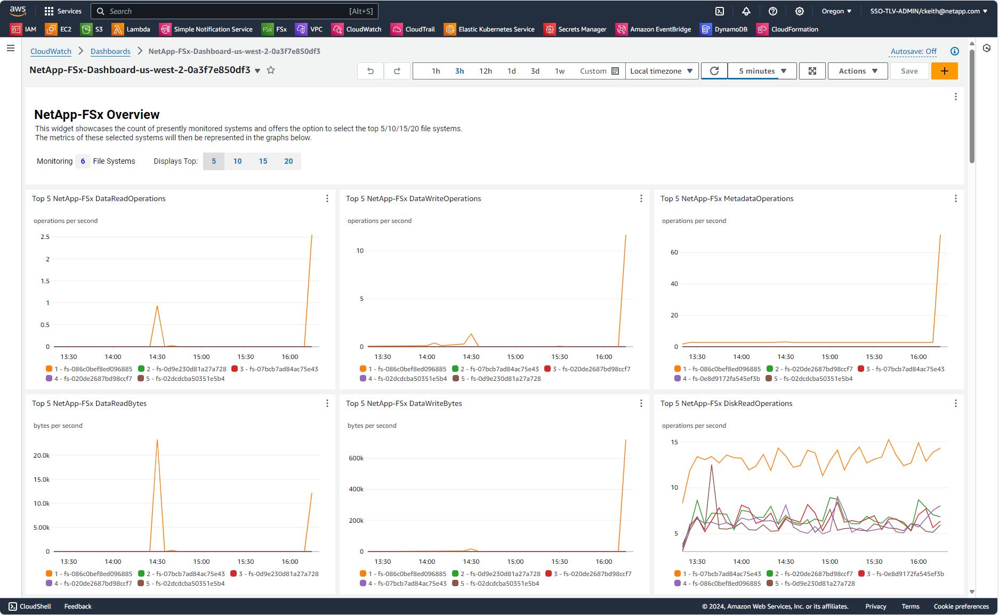

# AWS CloudWatch Dashboard for FSx for ONTAP

## Introduction
This sample provides a CloudFormation template to deploy an AWS CloudWatch dashboard for monitoring FSx for ONTAP systems. The dashboard offers comprehensive insights into your FSx for ONTAP resources, helping you monitor performance, track metrics, and manage alarms efficiently. 

The template creates the following resources:

1. Dashboard - The Amazon CloudWatch dashboard divided into four main sections: 
    1. Overview metrics of all FSx systems in the region.
    1. Metrics by individual FSx system.
    1. Metrics by volume ID.
    1. Alarms.
2. Lambda function - The service does the following:
    1. Build custom widgets for the dashboard.
    1. Collect metrics directly from ONTAP (like snapmirror health status).
    1. Create CloudWatch alarms for all files systems in the region.
3. Schedulers - Two Amazon EventBridge schedulers that trigger the Lambda function to:
    1. Collect ONTAP metrics. Scheduled to trigger every minute.
    1. Create, update or delete CloudWatch alarms. Scheduled to trigger once an hour.
4. Lambda Role - The IAM role that allows the Lambda function to run.
5. Scheduler Role - The IAM role that allows the scheduler to trigger the Lambda function.
6. SecretManager endpoint - The Lambda function runs inside a VPC, which by default lacks outgoing internet connectivity. To
enable the function to securely access the fsxadmin passwords stored in AWS Secrets Manager, a VPC endpoint for the Secrets
Manager service is required. This endpoint allows the Lambda function to retrieve sensitive information from Secrets Manager
without needing direct internet access, maintaining security while ensuring the function can access the necessary credentials.
7. CloudWatch endpoint - The Lambda function runs inside a VPC, which by default lacks outgoing internet connectivity. To enable
the function to send logs and metrics to CloudWatch, a VPC endpoint for the CloudWatch service is required. This endpoint allows
the Lambda function to communicate with CloudWatch without needing direct internet access, maintaining security while ensuring
proper monitoring and logging functionality.
8. FSxService endpoint - The Lambda function runs inside a VPC, which by default lacks outgoing internet connectivity. To enable the 
function to send calls to FSxService to retrieve file systems information.
 
## Prerequisites
1. You should have an AWS Account with the following permissions to create and manage resources:
    * "cloudformation:DescribeStacks"
    * "cloudformation:ListStacks"
    * "cloudformation:DescribeStackEvents"
    * "cloudformation:ListStackResources"
    * "cloudformation:CreateChangeSet"
    * "ec2:DescribeSubnets"
    * "ec2:DescribeSecurityGroups"
    * "ec2:DescribeVpcs"
    * "iam:ListRoles"
    * "iam:GetRolePolicy"
    * "iam:GetRole"
    * "iam:DeleteRolePolicy"
    * "iam:CreateRole"
    * "iam:DetachRolePolicy"
    * "iam:PassRole"
    * "iam:PutRolePolicy"
    * "iam:DeleteRole"
    * "iam:AttachRolePolicy"
    * "lambda:AddPermission"
    * "lambda:RemovePermission"
    * "lambda:InvokeFunction"
    * "lambda:GetFunction"
    * "lambda:CreateFunction"
    * "lambda:DeleteFunction"
    * "lambda:TagResource"
    * "codestar-connections:GetSyncConfiguration"
    * "ecr:BatchGetImage"
    * "ecr:GetDownloadUrlForLayer"
    * "scheduler:GetSchedule"
    * "scheduler:CreateSchedule"
    * "scheduler:DeleteSchedule"
    * "logs:PutRetentionPolicy"
    * "secretsmanager:GetSecretValue" (on specific secert)
2. Optional: create a secret in AWS Secrets Manager with key-value pairs of file system IDs and their corresponding fsxadmin 
passwords. This secret is necessary for making direct ONTAP API calls to monitor resources, such as SnapMirror relations.
Example secret structure:
```
    {
        "fs-111222333": "Password1",
        "fs-444555666": "Password2"
    }	
```
When deploying the CloudFormation template, you will need to provide the ARN of this secret as a parameter. This allows the Lambda function to securely access the passwords for monitoring purposes.
Note: If you choose not to provide this secret, some monitoring capabilities (such as SnapMirror relations metrics) may be limited.
 
## Usage
To use this solution, you will need to run the CloudFormation template in your AWS account.
The CloudFormation template requires the following parameters:

1. Stack name - Identifier for the CloudFormation stack. Must not exceed 25 characters. (Note: While AWS allows stack names up to 
128 characters, limit yours to 25. This name is used as base name for other resource names created within the stack, so keeping it short prevents issues with other resource names getting too long.)
2. VPC ID - The ID of the VPC in which the Lambda function will run. This VPC must have connectivity to all target file systems. It 
can be either the same VPC where the file systems are located, or a different VPC with established connectivity (e.g. VPC peering, Transit Gateway) to the file systems' VPCs.
3. Subnet IDs - The IDs of the subnets in which the Lambda function will run. These subnets must have connectivity to the file 		
systems.
4. Security Group IDs - The IDs of the Security Groups that will be associated with the Lambda function when it runs. These Security 
Groups must allow connectivity to the file systems.
5. Create FSx Service Endpoint - A boolean flag indicating whether you plan to create a FSxService VPC endpoint inside the VPC. Set 
this to true if you want to create the endpoint, or false if you don't. The decision to create this endpoint depends on whether you already have this type of endpoint. If you already have one, set this to false; otherwise, set it to true.	
6. Create Secret Manager Endpoint - A boolean flag indicating whether you plan to create a SecretManager VPC endpoint inside the 
VPC. Set this to true if you want to create the endpoint, or false if you don't. The decision to create this endpoint depends on whether you already have this type of endpoint. If you already have one, set this to false; otherwise, set it to true.
7. Create CloudWatch Endpoint - A boolean flag indicating whether you plan to create a CloudWatch VPC endpoint inside the VPC. Set 
this to true if you want to create the endpoint, or false if you don't. The decision to create this endpoint depends on whether you already have this type of endpoint. If you already have one, set this to false; otherwise, set it to true.
8. Secret Manager FSx Admin Passwords ARN - Optional - The ARN of the AWS Secrets Manager secret containing the fsxadmin passwords.
This ARN is required for certain functionalities, such as snapmirror metrics collection. 
If not provided, some features may not operate correctly. This secret should contain key-value pairs. 
The key is the File System ID, and the value is the fsxadmin password. For example:
```
    {
        "fs-111222333":"Password1",
        "fs-444555666":"Password2"
    }
```

## Important Disclaimer: CloudWatch Alarms Deletion
Please note that when you delete the CloudFormation stack associated with this project, the CloudWatch Alarms created by the stack will not be automatically deleted. 

CloudFormation does not manage the lifecycle of CloudWatch Alarms created by the Lambda function. This means that even after stack deletion, these alarms will persist in your AWS account.

To fully clean up resources after using this solution:
1. Delete the CloudFormation stack as usual.
2. Manually review and delete any associated CloudWatch Alarms through the AWS Console or using AWS CLI/SDK.
You can find the alarms by searching for the name prefix "FSx-ONTAP" in the CloudWatch Alarms section.

This behavior ensures that important monitoring setups are not unintentionally removed, but it requires additional steps for complete resource cleanup.

## Author Information

This repository is maintained by the contributors listed on [GitHub](https://github.com/NetApp/FSx-ONTAP-samples-scripts/graphs/contributors).

## License

Licensed under the Apache License, Version 2.0 (the "License").

You may obtain a copy of the License at [apache.org/licenses/LICENSE-2.0](http://www.apache.org/licenses/LICENSE-2.0).
 
Unless required by applicable law or agreed to in writing, software distributed under the License is distributed on an "AS IS" basis, without WARRANTIES or conditions of any kind, either express or implied.

See the License for the specific language governing permissions and limitations under the License.
