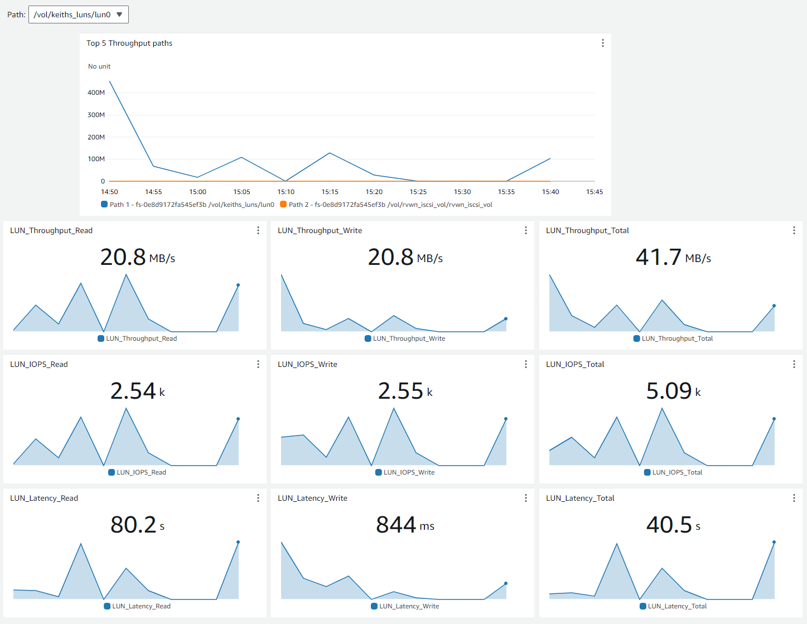

# LUN Monitoring

## Introduction

This solution provides the ability to export LUN metrics from an FSx for ONTAP file system into Amazon CloudWatch. It exports the Latency, IOPS, and Throughput metrics for a single file system.
The solution is based on a CloudFormation template that you need to deploy for each file system.

The template creates the following resources:

1. Lambda - The service that monitors the file system and collects the metrics.
2. Scheduler - The Amazon EventBridge scheduler that triggers the Lambda collection every minute.
3. Dashboard - The Amazon CloudWatch dashboard that shows 10 widgets. There are 9 widgets per metric (Latency, IOPS, Throughput - Read, Write, and Total) and 1 widget that shows the top 5 LUNs with the highest throughput.
4. Lambda Role - The IAM role that allows the Lambda service to run.
5. Scheduler Role - The IAM role that allows the scheduler to trigger the Lambda service.
6. SecretManager endpoint (optional) - Because the Lambda service runs inside the VPC, by default it will not have outgoing connectivity, so it needs to have a VPC endpoint to the SecretManager service. You can decide either to create it with CloudFormation or without CloudFormation.
7. CloudWatch endpoint (optional) - Because the Lambda service runs inside the VPC, by default it will not have outgoing connectivity, so it needs to have a VPC endpoint to the CloudWatch service. You can decide either to create it with CloudFormation or without CloudFormation.
8. SecretManager secret (optional) - In order to send the file system ONTAP REST APIs commands, the Lambda service needs the ONTAP credentials. The Lambda is designed to take the password from a secret. You can either provide an existing ARN with a key name, or to mark that the CloudFormation template will generate a secret.

## Prerequisites

You must have an AWS Account with the the following permissions:

- CloudFormation
    - cloudformation:CreateStack
    - cloudformation:DescribeStackEvents
    - cloudformation:DescribeStackResources
    - cloudformation:GetTemplate
    - cloudformation:ListStackResources
    - cloudformation:UpdateStack
    - cloudformation:DeleteStack

- IAM
    - iam:CreateRole
    - iam:PutRolePolicy
    - iam:AttachRolePolicy
    - iam:PassRole
    - iam:DetachRolePolicy
    - iam:DeleteRolePolicy
    - iam:DeleteRole

- Lambda
    - lambda:CreateFunction
    - lambda:InvokeFunction
    - lambda:DeleteFunction
    - lambda:GetFunction
    - lambda:UpdateFunctionCode
    - lambda:UpdateFunctionConfiguration

- EC2
    - ec2:CreateVpcEndpoint
    - ec2:CreateNetworkInterface
    - ec2:DescribeNetworkInterfaces
    - ec2:DeleteNetworkInterface
    - ec2:AssignPrivateIpAddresses
    - ec2:UnassignPrivateIpAddresses
    - ec2:DeleteVpcEndpoints

- Secrets Manager
    - secretsmanager:CreateSecret
    - secretsmanager:GetSecretValue
    - secretsmanager:DeleteSecret

- CloudWatch
    - cloudwatch:PutMetricData
    - cloudwatch:PutDashboard
    - cloudwatch:DeleteDashboards

## Usage

In order to use the solution, you will need to run the CloudFormation template in your AWS account.

The CloudFormation parameters are:

1. FileSystemId (Mandatory) - The ID of the FSx for ONTAP file system.
2. Subnet IDs - The subnet IDs on which the Lambda service will run - the subnets need to have connectivity to the file system.
3. Security Group IDs (Mandatory) - The SecurityGroup IDs with which the Lambda service will be associated when running - they need to provide connectivity to the file system.
4. VPC ID (Mandatory) - The VPC on which the Lambda service will run.
5. Create Secret Manager Endpoint (Not mandatory) - A flag if you plan to create the SecretManager VPC endpoint inside the VPC.
6. Create CloudWatch Endpoint (Not mandatory) - A flag if you plan to create the CloudWatch VPC endpoint inside the VPC.
7. Create Secret for the password - A flag if you plan to create the SecretManager secret. If this is marked as true, the parameter FSX admin password is mandatory.
8. FSX admin password - The fsxadmin password. This parameter is mandatory if you decide to create the SecretManager secret.
9. Secret Manager FSX admin password ARN - In case the user has already created a secret for the Lambda service and didn't mark to create the secret ARN, this parameter is mandatory.
10. Secret Manager FSX admin password key - The key of the fsxadmin secret password. If the user didn't mark to create secret ARN, this parameter is mandatory.

## Author Information

This repository is maintained by the contributors listed on [GitHub](https://github.com/NetApp/FSx-ONTAP-samples-scripts/graphs/contributors).

## License

Licensed under the Apache License, Version 2.0 (the "License").

You may obtain a copy of the License at [apache.org/licenses/LICENSE-2.0](http://www.apache.org/licenses/LICENSE-2.0).

Unless required by applicable law or agreed to in writing, software distributed under the License is distributed on an "AS IS" basis, without WARRANTIES or conditions of any kind, either express or implied.

See the License for the specific language governing permissions and limitations under the License.
