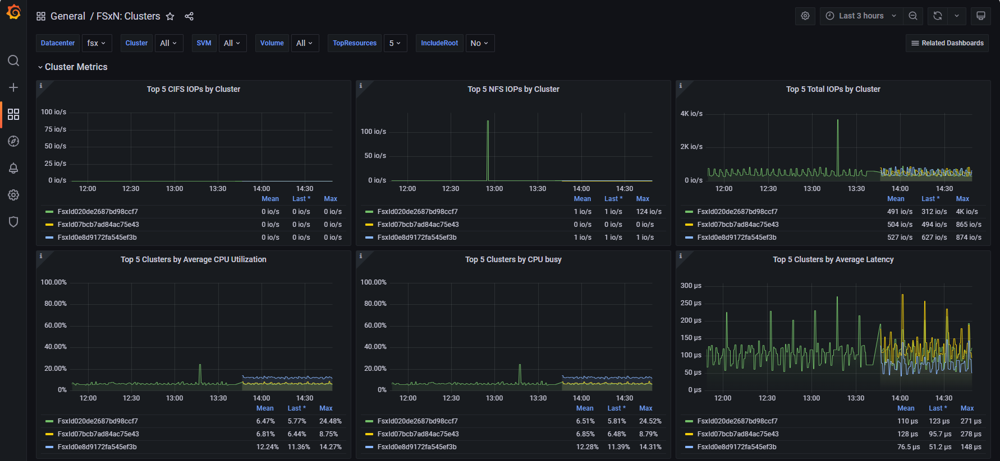
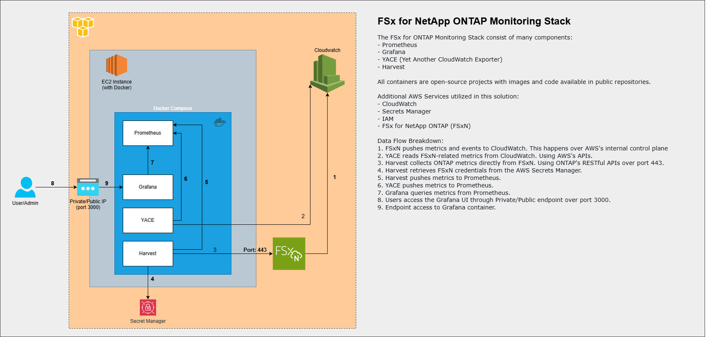

# :warning: **NOTICE:**

This repository is no longer being maintained. However, all the code found here has been relocated to a new NetApp managed GitHub repository found here [https://github.com/NetApp/FSx-ONTAP-utils/tree/main/Monitoring/Grafana/Monitor-FSxN-with-Harvest-on-EC2](https://github.com/NetApp/FSx-ONTAP-utils/tree/main/Monitoring/Grafana/Monitor-FSxN-with-Harvest-on-EC2) where it is continually updated. Please refer to that repository for the latest updates.

# Harvest/Grafana Deployment using AWS CloudFormation
This is the NetApp FSx for ONTAP deployment for monitoring FSx for ONTAP file systems with Grafana.  
The following solution leverages Harvest and YACE(Yet Another CloudWatch Exporter) as the exporters for ONTAP and CloudWatch metrics.

YACE, or Yet Another CloudWatch Exporter, is a Prometheus exporter for AWS CloudWatch metrics. It is written in
Go and uses the official AWS SDK. YACE supports auto-discovery of resources via tags, structured logging,
filtering monitored resources via regex, and more. You can read more about YACE capabilities from its
[Documentation](https://github.com/prometheus-community/yet-another-cloudwatch-exporter).

Here are some screenshots of a couple of the dashboards that are included to visualize the metrics collected by Harvest and YACE.




## Prerequisites
The only prerequisite is an FSx for ONTAP file system running in your AWS account.

## Architectural Overview

This solution uses several components to collect and display all the pertinent metrics from your FSx for ONTAP file system.
Instead of trying to describe them in words, the following architectural diagram does a great job of showing the components and how they interact with each other:


## Deployment Overview

There are two methods to deploy this solution, either via the AWS CloudFormation template or manually.
The steps below are geared towards the CloudFormation deployment method. If you want to deploy manually,
please refer to these [Manual Deployment Instructions](README-Manual.md).

This deployment includes:
- **Harvest**: Collects ONTAP metrics.[Documentation](https://github.com/NetApp/harvest).
- **Yet Another CloudWatch Exporter (YACE)**: Collects FSxN CloudWatch metrics.[Documentation](https://github.com/prometheus-community/yet-another-cloudwatch-exporter).
- **Prometheus**: Stores the metrics.
- **Grafana**: Visualizes the metrics.

## Deployment Steps

1. **Download the AWS CloudFormation Template file**
   - Download the `harvest-grafana-cf-template.yaml` file from this repo.

2. **Create the Stack**
   - Open the AWS console and to the CloudFormation service page.
   - Choose **Create stack** and select **With new resources**, 
   - Select **Choose an existing template** and **Upload a template file** 
   - Upload the `harvest-grafana-cf-template.yaml` file.
   - Click **Next**

3. **Specify Stack Details**
   - **Parameters**: Review and modify the parameters as needed for your file system. The default values are:
     - **InstanceType**: Select the instance type to run the Harvest+Grafana+Prometheus stack. You should allocate at least 2 vCPUs and 1GB of RAM for every 10 FSxN file systems you plan to monitor. The default is `t3.medium`.
     - **KeyPair**: Specify the key pair to access the EC2 instance.
     - **SecurityGroup**: Ensure inbound ports 22, 3000 and 9090 are open.
     - **SubnetType**: Choose `public` or `private`. `Public` will allocated a public IP address to the EC2 instance.
     - **Subnet**: Specify a subnet that will have connectivity to all the FSxN file systems you plan to monitor over TCP port 433.
     - **InstanceAmiId**: Specify the Amazon Linux 2 AMI ID for the EC2 instance. The default is the latest version.
     - **FSxEndPoint**: Specify the management endpoint IP address of your FSx file system.
     - **SecretName**: Specify the AWS Secrets Manager secret name containing the password for the `fsxadmin` user.

4. **Configure Stack Options**
   - Click **Next** for stack options.

5. **Review and Create**
   - Review the stack details and confirm the settings.
   - Select the check box to acknowledge that the template creates IAM resources.
   - Choose **Create stack**.

6. **Monitor Stack Creation**
   - Monitor the status of the stack in the AWS CloudFormation console. The status should change to `CREATE_COMPLETE` in about five minutes.

## Accessing Grafana

- After the deployment is complete, log in to the Grafana dashboard using your browser:
  - URL: `http://<EC2_instance_IP>:3000`
  - Default credentials:
    - Username: `admin`
    - Password: `admin`
  - **Note**: You will be prompted to change your password upon the first login.

## Supported Dashboards

Amazon FSx for NetApp ONTAP exposes a different set of metrics than on-premises NetApp ONTAP. 
Therefore, only the following out-of-the-box Harvest dashboards tagged with `fsx` are currently supported for use with FSx for ONTAP. 
Some panels in these dashboards may be missing information that is not supported:

- **FSxN_Clusters**
- **FSxN_CW_Utilization**
- **FSxN_Data_protection**
- **FSxN_LUN**
- **FSxN_SVM**
- **FSxN_Volume**

---

## Monitor additional AWS FSx for NetApp ONTAP

To monitor additional FSxN resources, follow these steps:

1. **Log in via SSH to the EC2 instance**

2. **Move to the Harvest Directory**
   - Navigate to the Harvest directory:
     ```bash
     cd /opt/harvest
     ```

3. **Configure Additional AWS FSx for NetApp ONTAP in `harvest.yml`**
   - Edit the `harvest.yml` file to add the new AWS FSx for NetApp ONTAP configuration. For example:
   
     ```yaml
     fsx02:
       datacenter: fsx
       addr: <FSxN_ip_2>
       collectors:
         - Rest
         - RestPerf
         - Ems
       exporters:
         - prometheus1
       credentials_script:
         path: /opt/fetch-credentials
         schedule: 3h
         timeout: 10s
     ```

4. **Update `harvest-compose` with the Additional FSx for NetApp ONTAP**
   - In the same directory, edit the `harvest-compose.yml` file to include the new FSx for NetApp ONTAP configuration:
	 
	 ```yaml
     fsx02:
       image: ghcr.io/tlvdevops/harvest-fsx:latest
       container_name: poller-fsx02
       restart: unless-stopped
       ports:
         - "12991:12991"
       command: '--poller fsx02 --promPort 12991 --config /opt/harvest.yml'
       volumes:
         - ./cert:/opt/harvest/cert
         - ./harvest.yml:/opt/harvest.yml
         - ./conf:/opt/harvest/conf
       environment:
         - SECRET_NAME=<your_secret_2>
         - AWS_REGION=<your_region>
     ```
   - **Note**: Make the following changes for each system you add:

       - The name of the block (i.e. the first line of the block).
       - The `container_name`.
       - The `ports`. All pollers must use a different port. Just increment by one for each system.
       - The `command` parameter should be updated with:
           - The name after the `--poller` should match the block name.
           - The `promPort` port should match the port in the `ports` line set above.
       - The `SECRET_NAME` as needed.

5. **Add FSx for NetApp ONTAP to Prometheus Targets**
    - Navigate to the Prometheus directory:
      ```bash
      cd /opt/harvest/container/prometheus/
      ```
    - Edit the `harvest_targets.yml` file to add the new FSx for NetApp ONTAP target:
      ```yaml
      - targets: ['fsx01:12990','fsx02:12291']
      ```

6. **Restart Docker Compose**
    - Navigate to the Harvest directory:
	  ```bash
	  cd /opt/harvest
	  ``` 
    - Bring down the Docker Compose stack:
      ```bash
      docker-compose -f prom-stack.yml -f harvest-compose.yml down
      ```
    - Bring the Docker Compose stack back up:
      ```bash
      docker-compose -f prom-stack.yml -f harvest-compose.yml up -d --remove-orphans
      ```

---

## Author Information

This repository is maintained by the contributors listed on [GitHub](https://github.com/NetApp/FSx-ONTAP-samples-scripts/graphs/contributors).

## License

Licensed under the Apache License, Version 2.0 (the "License").

You may obtain a copy of the License at [apache.org/licenses/LICENSE-2.0](http://www.apache.org/licenses/LICENSE-2.0).

Unless required by applicable law or agreed to in writing, software distributed under the License is distributed on an _"AS IS"_ basis, without WARRANTIES or conditions of any kind, either express or implied.

See the License for the specific language governing permissions and limitations under the License.

© 2025 NetApp, Inc. All Rights Reserved.
