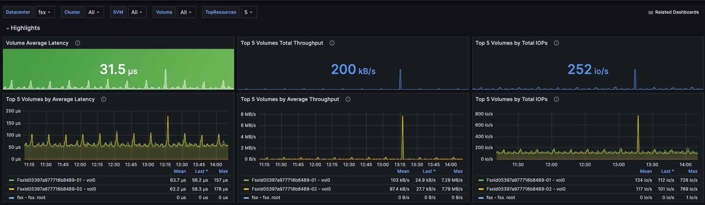
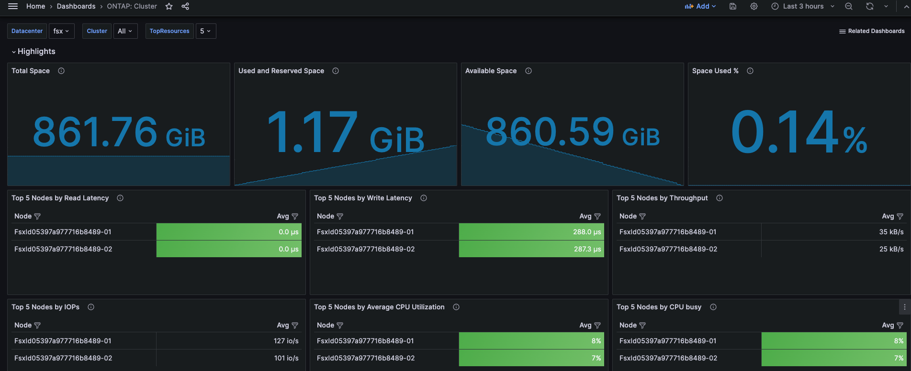

# Deploy NetApp Harvest on EKS 

Harvest helm chart for monitoring Amazon FSx for ONTAP with Harvest, Grafana and Prometheus on EKS.

## Introduction
This sample shows how to deploy NetApp Harvest on an EKS cluster to monitor an Amazon FSx for NetApp ONTAP file system.
Harvest is a data collector that collects metrics from a NetApp ONTAP storage system and provides a REST API
for accessing the collected data. Harvest can be used to monitor the performance of your FSx for ONTAP
file system and visualize the metrics on Grafana. You can read more about Harvest [here](https://netapp.github.io/harvest/).

## What to expect

Harvest Helm chart installation will result the following:
* Installing the latest version of NetApp Harvest into your EKS cluster.
* Collecting metrics about your FSx for ONTAP.
* Add Grafana dashboards for visualization.

## Prerequisites
* `helm` - for resources installation.
* `kubectl` - for cluster interaction.
* An EKS cluster. If you don't have one, you can use the instructions from another one of our samples [FSxN-as-PVC-for-EKS](https://github.com/NetApp/FSx-ONTAP-samples-scripts/tree/main/EKS/FSxN-as-PVC-for-EKS). Follow the instructions up to the point where it suggests you create a "stateful application."
* A NetApp FSx for ONTAP accessible from the same VPC as your EKS cluster. If you don't already have one the sample above will create one for you.
* If you want Prometheus to have persistent storage, you will need a storage class defined. The sample mentioned above
will set one up for you. It leverages NetApp's Astra Trident to offer up storage from your FSx for ONTAP file system to a Kubernetes cluster.
You can install Trident from the AWS Marketplace into your EKS cluster. For additional information on how to use Trident, please refer to the
[Trident documentation](https://docs.netapp.com/us-en/trident/).

## Deployment of Prometheus and Grafana
If you don't already have Prometheus and Grafana running in your EKS cluster, you can deploy both of them
from the Prometheus community repository by using the following commands:
```bash
helm repo add prometheus-community https://prometheus-community.github.io/helm-charts
helm repo update
helm install kube-prometheus-stack prometheus-community/kube-prometheus-stack --namespace prometheus --create-namespace \
  --set prometheus.prometheusSpec.storageSpec.volumeClaimTemplate.spec.storageClassName=<FSX-BASIC-NAS>, \
  --set prometheus.prometheusSpec.storageSpec.volumeClaimTemplate.spec.resources.requests.storage=50Gi
```
Where:
* \<FSX-BASIC-NAS\> is the storage class you want to use.  If you don't care about persistent storage, you can omit the
last two lines from the above command.

The above will create a 50Gib PVC for Prometheus to use. You can adjust the size as needed.

A successful installation should look like this:
```bash
$ helm install kube-prometheus-stack prometheus-community/kube-prometheus-stack --namespace prometheus --create-namespace \
  --set prometheus.prometheusSpec.storageSpec.volumeClaimTemplate.spec.storageClassName=fsx-basic-nas, \
  --set prometheus.prometheusSpec.storageSpec.volumeClaimTemplate.spec.resources.requests.storage=50Gi
NAME: kube-prometheus-stack
LAST DEPLOYED: Fri Jul 26 22:57:04 2024
NAMESPACE: prometheus
STATUS: deployed
REVISION: 1
NOTES:
kube-prometheus-stack has been installed. Check its status by running:
  kubectl --namespace prometheus get pods -l "release=kube-prometheus-stack"
```
Visit [Prometheus Operator](https://github.com/prometheus-operator/kube-prometheus) for instructions on how to create & configure the Alertmanager and Prometheus instances using the Operator.

To check the status, you can run the following command:
```bash
kubectl get pods -n prometheus
```
It should look something like this:
```bash
$ kubectl get pods -n prometheus
NAME                                                        READY   STATUS    RESTARTS   AGE
alertmanager-kube-prometheus-stack-alertmanager-0           2/2     Running   0          51s
kube-prometheus-stack-grafana-86844f6b47-njw6n              3/3     Running   0          56s
kube-prometheus-stack-kube-state-metrics-7c8d64d446-rj4tv   1/1     Running   0          56s
kube-prometheus-stack-operator-85b765d6bc-ll5q2             1/1     Running   0          56s
kube-prometheus-stack-prometheus-node-exporter-7rtbp        1/1     Running   0          56s
kube-prometheus-stack-prometheus-node-exporter-ffckd        1/1     Running   0          56s
prometheus-kube-prometheus-stack-prometheus-0               2/2     Running   0          50s
```

## Deploy Harvest on EKS
Now that you have Prometheus and Grafana running, you are ready to deploy Harvest to monitor your FSx for ONTAP file system.

### Input Parameters
These parameters can either be provided at the command line when you run the `helm upgrade` command, or by putting them in the `values.yaml` file.
|Parameter|Description| 
|:---|:---| 
|fsx.managment\_lif|The FSx for NetApp ONTAP file system management IP. You can get this information from the AWS console.|
|fsx.username|The username that Harvest will use to authenticate wth to the FSx for ONTAP file system. It will default to 'fsxadmin'. Note that since Harvest does not support using AWS secrets it is recommended that you use an account that has been assigned the fsxadmin-readonly role.|
|fsx.password|The password that Harvest will use to authenticate with to the FSx for ONTAP file system. |
|prometheus|Is the release name of the Prometheus instance you want to use to store the monitoring data. If you installed it with the commands above, that will be `kube-prometheus-stack`|

### Installation
To install Harvest helm chart from the Prometheus Community GitHub repository you will first need to copy the
contents that are part of this repository to your local system. It will probably be easier to just clone the
entire repo by running the follow command as opposed to copying the files individually:
```bash
git clone https://github.com/NetApp/FSx-ONTAP-samples-scripts.git
```
Then navigate to Helm Chart configuration files in this sample's directory:
```
cd FSx-ONTAP-samples-scripts/Monitoring/monitor_fsxn_with_harvest_on_eks/HelmChart
```
Either make the following substitutions to the command line below or update the `values.yaml` file with the following information.
Additional information about the these parameters can be found in the [Input Parameters](#input-parameters) section above.
* \<usernname> - The username you want Harvest to use to authenticate with the FSxN file system.
* \<password> - The password you want Harvest to use to authenticate with the FSxN file system.
* \<managment\_lif> - The IP address, or DNS hostname, of the FSx for ONTAP file system management endpoint.
* \<prometheus> - The release name of the Prometheus instance you want to use to store the monitoring data.

```bash
helm repo add prometheus-community https://prometheus-community.github.io/helm-charts
helm repo update
helm upgrade --install harvest -f values.yaml ./ --namespace=harvest --create-namespace --set fsx.managment_lif=<managment_lif> \
    --set fsx.username=<username>  --set fsx.password=<password> --set prometheus=<prometheus>
```

:bulb: **Tip:** Put the above commands in your favorite text editor and make the substitutions there. Then copy and paste the commands into the terminal.

A successful installation should look like this:
```bash
$ helm upgrade --install harvest -f values.yaml ./ --namespace=harvest --create-namespace --set fsx.managment_lif=198.19.255.245 --set fsx.username=fsxadmin  --set fsx.password=redacted --set prometheus=kube-prometheus-stack
Release "harvest" does not exist. Installing it now.
NAME: harvest
LAST DEPLOYED: Mon Jul 29 22:49:57 2024
NAMESPACE: harvest
STATUS: deployed
REVISION: 1
TEST SUITE: None
```

Once the deployment is complete, Harvest should be listed as a target on Prometheus.

### Accessing Grafana

If you installed Grafana with the steps above, you'll need a way to access it. The quick way to do that is by running the following command:
```bash
kubectl port-forward -n prometheus $(kubectl -n prometheus get pods | grep kube-prometheus-stack-grafana | awk '{print $1}') 3000 &
```
This will forward port 3000 on your local machine to the Grafana instance running in the EKS cluster. At that point you can just open your browser and navigate to `http://localhost:3000` and login with the default username and password (admin/prom-operator).

If you `ssh` into the server where you performed the installation, you'll need to forward port 3000 to that server from your local system. You can do that by running the following command from your local machine:
```bash
ssh -L 3000:localhost:3000 -N -f <server>
```
Where `<server>` is the server you are connecting to.

Notes:
* The -L option specifies the port forwarding. The first number is the port on the local machine. The second part is the hostname where the forwarding will be setup, where `localhost` means the local system. The third part is the port of the remote server.
* The -N option tells ssh not to execute a remote command.
* The -f option tells ssh to go into the background after setting up the port forwarding.
* This command works from a terminal window on a Linux or Mac system. If you are using Windows, you will need to have
[WSL](https://learn.microsoft.com/en-us/windows/wsl/install) installed and run the command from there.
* If you also have to provide an -i option to provide authentication, as well as an -l option to specify a specific user, you'll also need to provide those options as well.

To provide for a more consistent access, you can create a load balancer service for Grafana. You can read more about how to do that
[here](https://aws.amazon.com/blogs/containers/exposing-kubernetes-applications-part-1-service-and-ingress-resources/).
    
### Adding Grafana dashboards and visualize your FSxN metrics on Grafana
There are a few sample dashboards in the `dashboards` folder that you can import into Grafana to visualize the metrics that Harvest is collecting.
* [How to import Grafana dashboards.](https://grafana.com/docs/grafana/latest/dashboards/build-dashboards/import-dashboards/)
* [Supported Harvest Dashboards.](https://netapp.github.io/harvest/24.05/prepare-fsx-clusters/#supported-harvest-dashboards/)

Notes:
When importing the dashboard, be sure to select the Prometheus data source that you are using to store the metrics.

## Notes
* The FSxN fsxadmin user does not have full permission to collect all metrics. Because of that some traditional ONTAP dashboards may not fully populate.
* Currently, Harvest only supports one FSxN per deployment. If you have more than one FSxN, you should create a separate deployment for each.
* The fsxadmin user password exists in the Harvest config map due to Harvest limitation (i.e. it can't be configured to use an AWS secret).

## Screenshots
Here are some screenshots of the Grafana dashboards that are included in the `dashboards` folder.



