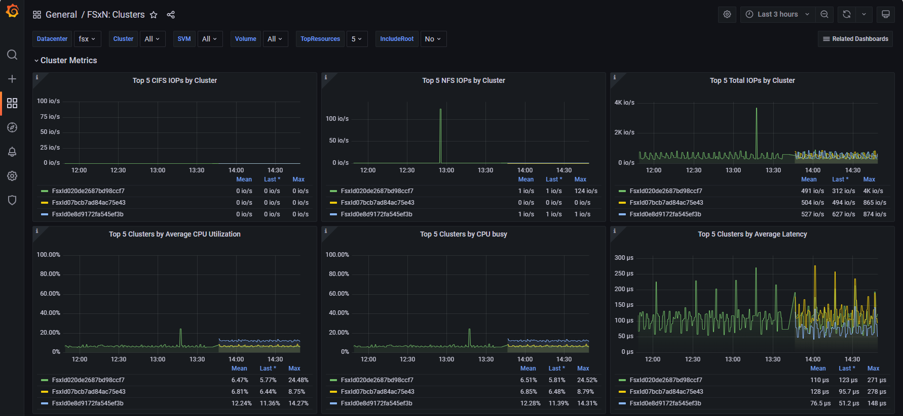
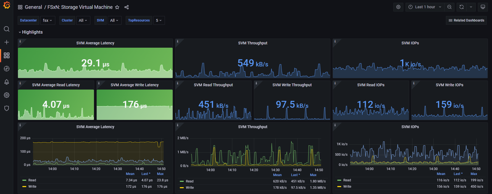
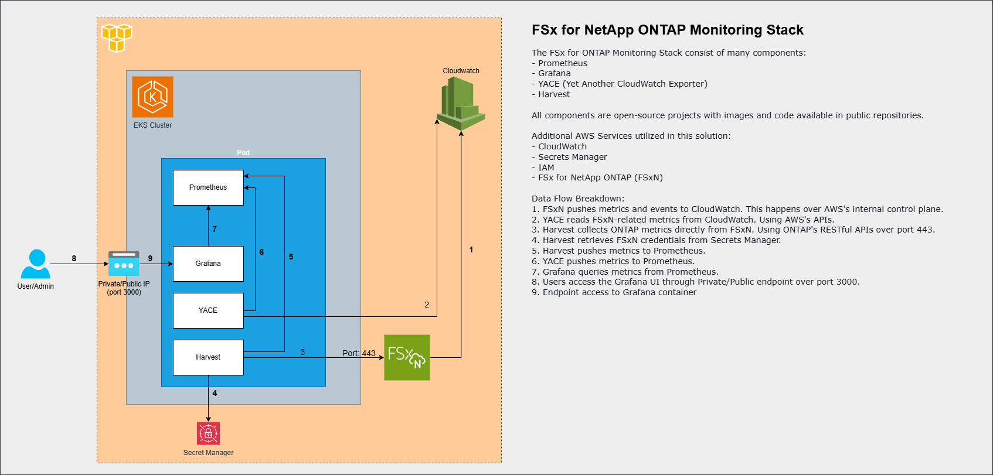

# Deploy NetApp Harvest on EKS 

This subfolder contains a Helm chart to install [NetApp Harvest](https://github.com/NetApp/harvest/blob/main/README.md)
into an AWS EKS cluster to monitor multiple FSx for ONTAP file systems using the
Grafana + Prometheus stack. It uses the AWS Secrets Manager to obtain
credentials for each of the FSxN file systems so those credentials aren't insecurely stored.

Here are some screenshots of a couple of the dashboards that are included to visualize the metrics collected by Harvest and YACE.





## Introduction

### Architectural Overview

This solution uses several components to collect and display all the pertinent metrics from your FSx for ONTAP file system.
Instead of trying to describe them in words, the following architectural diagram does a great job of showing the components and how they interact with each other:


### What to expect

Harvest Helm chart installation will result the following:
* Install the latest version of NetApp Harvest on to your EKS cluster.
* Each FSxN cluster will have its own Harvest poller in the EKS cluster.
* Collecting metrics about your FSxNs and adding existing Grafana dashboards for better visualization.

### Integration with AWS Secrets Manager
This Harvest installation uses the AWS Secrets Manager to obtain the credentials for the each of FSxN file systems.
The format of the secret string should to be a json structure with a `username` and `password` keys. For example:
```json
{
  "username": "fsxadmin",
  "password": "fsxadmin's_password"
}
```
A service account should be created during the installation of Harvest with the sufficient permissions to fetch the secrets.

### Prerequisites
* An AWS EKS cluster.
* An FSx for ONTAP file system with connectivity to the EKS cluster.
    * If you don't have an EKS cluster with FSx for ONTAP file system, you can follow the steps in the [FSx as PVC for EKS](https://github.com/NetApp/FSx-ONTAP-samples-scripts/tree/add_grafana_eks/EKS/FSxN-as-PVC-for-EKS) repository to build one.
* `Helm` - for resources installation.
* `kubectl` - for managing Kubernetes resources.
* `eksctl` - for creating and managing EKS clusters.
* `jq` - for parsing JSON data in the command line. This is optional but recommended for some of the commands below.

## Deployment

### Deployment of Prometheus and Grafana
If you don't already have Prometheus and Grafana running in your EKS cluster, you can deploy both of them
using the Helm chart from the Prometheus community repository by using the following commands:

:memo: **NOTE:** You need to make a substitution in the command below before running it.
```bash
helm repo add prometheus-community https://prometheus-community.github.io/helm-charts
helm repo update
helm install kube-prometheus-stack prometheus-community/kube-prometheus-stack --namespace prometheus --create-namespace \
  --set prometheus.prometheusSpec.storageSpec.volumeClaimTemplate.spec.resources.requests.storage=50Gi \
  --set prometheus.prometheusSpec.storageSpec.volumeClaimTemplate.spec.storageClassName=<FSX-BASIC-NAS>
```
Where:
* \<FSX-BASIC-NAS\> is the storage class you want to use to store the data collected from the FSxN file systems.
If you don't care about persistent storage, you can omit the last two lines from the above command.

The above will create a 50Gib PVC for Prometheus to use. You can adjust the size as needed.

A successful installation should look like this:
```
$ helm install kube-prometheus-stack prometheus-community/kube-prometheus-stack --namespace prometheus --create-namespace \
  --set prometheus.prometheusSpec.storageSpec.volumeClaimTemplate.spec.resources.requests.storage=50Gi \
  --set prometheus.prometheusSpec.storageSpec.volumeClaimTemplate.spec.storageClassName=fsx-basic-nas
NAME: kube-prometheus-stack
LAST DEPLOYED: Fri Jul 26 22:57:04 2024
NAMESPACE: prometheus
STATUS: deployed
REVISION: 1
NOTES:
kube-prometheus-stack has been installed. Check its status by running:
  kubectl --namespace prometheus get pods -l "release=kube-prometheus-stack"

Visit https://github.com/prometheus-operator/kube-prometheus for instructions on how to create & configure the Alertmanager and Prometheus instances using the Operator.
```
To check the status, you can run the following command:
```bash
kubectl get pods -n prometheus
```
The output should look something like this:
```bash
$ kubectl get pods -n prometheus
NAME                                                        READY   STATUS    RESTARTS   AGE
alertmanager-kube-prometheus-stack-alertmanager-0           2/2     Running   0          51s
kube-prometheus-stack-grafana-86844f6b47-njw6n              3/3     Running   0          56s
kube-prometheus-stack-kube-state-metrics-7c8d64d446-rj4tv   1/1     Running   0          56s
kube-prometheus-stack-operator-85b765d6bc-ll5q2             1/1     Running   0          56s
kube-prometheus-stack-prometheus-node-exporter-7rtbp        1/1     Running   0          56s
kube-prometheus-stack-prometheus-node-exporter-ffckd        1/1     Running   0          56s
prometheus-kube-prometheus-stack-prometheus-0               2/2     Running   0          50s
```

### Deployment of the Harvest Helm chart

#### 1. Download the Harvest Helm chart
Download the Harvest helm chart by copying the contents of the 'harvest' directory found in this repo. The easiest
way to do that, is to simply clone the entire repo and change into the `harvest` directory:
```bash
git clone https://github.com/NetApp/FSx-ONTAP-samples-scripts.git
cd FSx-ONTAP-samples-scripts/Monitoring/monitor_fsxn_with_harvest_on_eks/harvest
```
This custom Helm chart includes:
* `deplyment.yaml` - Harvest deployment using Harvest latest version image
* `harvest-config.yaml` - Harvest backend configuration
* `harvest-cm.yaml` -  Environment variables configuration for credentials script.
* `service-monitor.yaml` - Prometheus ServiceMonitor for collecting Harvest metrics.

:memo: **NOTE** You should not have to modify these files.

#### 2. Specify which FSxNs to monitor

The Helm chart supports monitoring multiple FSxNs. You can add multiples FSxNs by editing the `values.yaml` file
and updating the `clusters` section. The following is an example with two FSxNs.
```
fsxs:
  clusters:
    - name: <fsx1>
      managment_lif: <FSx1_Management_LIF>
      promPort: 12990
      secretName: <FSx1_secret_name>
      region: <FSx1_region>
    - name: <fsx2>
      managment_lif: <FSx2_Management_LIF>
      promPort: 12991
      secretName: <FSx2_secret_name>
      region: <FSx2_region>
```
Of course replace the strings within the <> with your own values.

:memo: **NOTE:** Each FSxN cluster must have unique port number for promPort between the range of 12990 and 14000.

#### 3. Create AWS Secrets Manager for FSxN credentials
If you don't already have an AWS Secrets Manager secret with your FSxN credentials, you can create one using the AWS CLI.
```
aws secretsmanager create-secret --region <REGION> --name <SECRET_NAME> \
  --secret-string '{"USERNAME":"fsxadmin", "PASSWORD":"<YOUR_FSX_PASSWORD>"}'
```
Replace `<YOUR_FSX_PASSWORD>` with the actual password for the `fsxadmin` user on your FSxN file system.

#### 4. Create Service Account with permissions to read the AWS Secrets Manager secrets

##### 4a. Create Policy
The following IAM policy can be used to grant the all the permissions required by Harvest to fetch the secrets.
Note in this example, it has places to put two AWS Secrets Manager ARNs. You should add all the secret ARNs
for all the FSxN you plan to monitor. Typically on per FSxN, but it is okay to use the same secret for multiple
FSxNs as long as the credentials are the same.

```
{
    "Statement": [
        {
            "Action": [
                "secretsmanager:GetSecretValue",
                "secretsmanager:DescribeSecret",
                "secretsmanager:ListSecrets"
            ],
            "Effect": "Allow",
            "Resource": [
                "<your_secret_manager_arn_1>",
                "<your_secret_manager_arn_2>"
            ]
        }
    ],
    "Version": "2012-10-17"
}
```
Of course replace the strings within the <> with your own values. Save the edited policy in a file named `harvest-read-secrets-policy.json`.

You can use the following command to create the policy:
```bash
POLICY_ARN=$(aws iam create-policy --policy-name harvest_read_secrets --policy-document file://harvest-read-secrets-policy.json --query Policy.Arn --output text)
```
Note that this sets a variable named `POLICY_ARN` to the ARN of the policy that is created.
It is done this way to make it easy to pass that policy ARN when you create the service account in the next step.

##### 4b. Create ServiceAccount
The following command will create a role, associated with the policy created above, and an Kubernettes service account that Harvest will run under:
```
eksctl create iamserviceaccount --name harvest-sa --region=<REGION> --namespace <NAMESPACE> --role-name harvest-role --cluster <YOUR_CLUSTER_NAME> --attach-policy-arn "$POLICY_ARN" --approve
```
Of course replace all the strings within the <> with your own values. Note that the `<NAMESPACE>` should
be where your Prometheus stack is deployed. If you used the command above to install Prometheus
then the namespace should be `prometheus`.

#### 5. Install Harvest helm chart
Once you have update the values.yaml file, created the AWS Secrets Manager secrets,
and created the service account with permissions to read the secrets, you are ready to install the Harvest Helm chart
by running:
```text
helm upgrade --install harvest  -f values.yaml ./ --namespace=<NAMESPACE> --set promethues=<your_promethues_release_name>
```
Note that the `<NAMESPACE>` should be where your Prometheus stack is deployed. If you used the command above to install Prometheus
then it will be `prometheus`.

Once the deployment is complete, Harvest should be listed as a target on Prometheus. You can check that by running
the following commands. The first one sets up a port forwarder for port 9090 on your local machine to the Prometheus server running
in the EKS cluster as a background job.
```bash
kubectl port-forward -n prometheus prometheus-kube-prometheus-stack-prometheus-0 9090 &
sleep 4  # Give it a few seconds to establish the connection
curl -s http://localhost:9090/api/v1/targets | jq -r '.data.activeTargets[] | select(.labels.service[0:14] == "harvest-poller") | "\(.labels.service) Status = \(.health)"'
```
It should list a status of 'up' for each of the FSxN clusters you are monitoring. For example:
```
$ curl -s http://localhost:9090/api/v1/targets | jq -r '.data.activeTargets[] | select(.labels.service[0:14] == "harvest-poller") | "\(.labels.service) Status = \(.health)"'
Handling connection for 9090
harvest-poller-dr Status = up
harvest-poller-prod Status = up
```
You might have to give it a minute before getting an 'up' status.

Once you have obtain the status, you don't need the "kubctl port-forward" command running anymore. You can stop it by running:
```bash
kill %?9090
```
That kills any background job that has 9090 in the command line, which the port forwarding command should have.

### Import FSxN CloudWatch metrics into your monitoring stack using YACE
AWS CloudWatch provides metrics for the FSx for ONTAP file systems which cannot be collected by Harvest.
Therefore, we recommend to using the [yet-another-cloudwatch-exporter](https://github.com/prometheus-community/yet-another-cloudwatch-exporter)
(by Prometheus community) to collect these metrics.

#### 1. Create Service Account with permissions to get AWS CloudWatch metrics
The following IAM policy can be used to grant the all permissions required by YACE to fetch the CloudWatch metrics:

```
{
    "Version": "2012-10-17",
    "Statement": [
      {
        "Action": [
          "tag:GetResources",
          "cloudwatch:GetMetricData",
          "cloudwatch:GetMetricStatistics",
          "cloudwatch:ListMetrics",
          "apigateway:GET",
          "aps:ListWorkspaces",
          "autoscaling:DescribeAutoScalingGroups",
          "dms:DescribeReplicationInstances",
          "dms:DescribeReplicationTasks",
          "ec2:DescribeTransitGatewayAttachments",
          "ec2:DescribeSpotFleetRequests",
          "shield:ListProtections",
          "storagegateway:ListGateways",
          "storagegateway:ListTagsForResource"
        ],
        "Effect": "Allow",
        "Resource": "*"
      }
    ]
  }

```
The policy shown above is in a file named `yace-export-policy.json` in the repo. You shouldn't
have to modify the file so just run the following command in order to create the policy:
```bash
POLICY_ARN=$(aws iam create-policy --policy-name yace-exporter-policy --policy-document file://yace-exporter-policy.json --query Policy.Arn --output text)
```
Note that this sets a variable named `POLICY_ARN` to the ARN of the policy that is created.
It is done this way to make it easy to pass that policy ARN when you create the service account in the next step.

#### 2. Create the service account
The following command will create a role associated with the policy created above, and a Kubernetes service account that YACE will run under:

```bash
eksctl create iamserviceaccount --name yace-exporter-sa --region=<REGION> --namespace <NAMESPACE> --role-name yace-cloudwatch-exporter-role --cluster <YOUR_CLUSTER_NAME> --attach-policy-arn "$POLICY_ARN" --approve
```
Of course replace the strings within the <> with your own values. Note, the overrides file below assumes the account
name is `yace-exporter-sa` so if you change it, you will need to update the overrides file accordingly.

#### 3. Install yace-exporter helm chart
First add the nerdswords Helm repository to your local Helm client. This repository contains the YACE exporter chart.

```bash
helm repo add nerdswords https://nerdswords.github.io/helm-charts
helm repo update
```
Edit the `yace-override-values.yaml` file found in this repo by changing the prometheus release name in the ServiceMonitor section:
```
serviceMonitor:
  enabled: true
  labels:
    release: <Prometheus_Name>
```
If you installed Prometheus using the previous steps, the release name will be `kube-prometheus-stack`.

While editing that file, also update the region name, in both places, to FSxN's region in the "config" section:
```
  apiVersion: v1alpha1
  sts-region: <Region_Name>
  discovery:
    jobs:
    - type: AWS/FSx
      regions:
        - <Region_Name>
      period: 300
      length: 300
      metrics:
      - name: DiskReadOperations
        statistics: [Average]
      - name: DiskWriteOperations
        statistics: [Average]
      - name: DiskReadBytes
        statistics: [Average]
      - name: DiskWriteBytes
        statistics: [Average]
      - name: DiskIopsUtilization
        statistics: [Average]
      - name: NetworkThroughputUtilization
        statistics: [Average]
      - name: FileServerDiskThroughputUtilization
        statistics: [Average]
```

Finally, run the following command to install the yace-exporter helm chart:
```text
helm install yace-cw-exporter --namespace <NAMESPACE> nerdswords/yet-another-cloudwatch-exporter -f yace-override-values.yaml
```
Of course replace the strings within the <> with your own values.

### Accessing Grafana
If you newly installed the Prometheus stack, that includes Grafana, you will need to provide a way of accessing it from the Kubernetes cluster.
One way to do that is to setup a "port-forward" from your local machine using the following command:

```bash
kubectl --namespace prometheus port-forward svc/kube-prometheus-stack-grafana 3000:80 --address 0.0.0.0/0 &
```

This is okay for a test, but this method is not persistent and would force everyone to go through your local machine to access the Grafana dashboards.
To allow for more permanent access to Grafana, you should consider setting up an LoadBalancer service.
That can easily be done by running:
```bash
kubectl expose deployment kube-prometheus-stack-grafana --port=80 --target-port=3000 --name=load-balancer-service --type=LoadBalancer
```

This will create a AWS Elastic Load Balancer (ELB) in front of the Grafana service, which will allow you to access Grafana via the ELB's DNS name.
To get the DNS name, you can run the following command:
```bash
kubectl get svc load-balancer-service --namespace prometheus
```
The output should be similar to this:
```bash
NAME                    TYPE           CLUSTER-IP     EXTERNAL-IP                                                               PORT(S)        AGE
load-balancer-service   LoadBalancer   172.20.85.44   ab130084a571d4e59afeabafb0477037-1196442078.us-west-2.elb.amazonaws.com   80:30611/TCP   56m
```
The `EXTERNAL-IP` column will show the DNS name of the ELB that was created. You can use this DNS name to access Grafana from your web browser.
Once you have access to Grafana, you can log in using the default credentials:
* **Username:** `admin`
* **Password:** `prom-operator`

### Adding Grafana dashboards and visualize your FSxN metrics on Grafana
Once you login, you'll want to import some dashboards to visualize the metrics collected by Harvest and YACE. You will find
some example dashboards in the `dashboards` folder in this repository. You can import these dashboards into Grafana by following these steps:
1. Download the dashboards from the `dashboards` folder in this repository to your local PC.
1. Log in to your Grafana instance.
1. Click on the "+" icon on the left-hand side menu and select "Import Dashboard".
1. Click in the box with "Upload dashboard JSON file" and browse to one of the dashboard JSON files from the `dashboards` folder in this repository.
1. Click "Import."

You can repeat the steps above for each of the dashboard JSON files you want to import.

You can also import the "default" dashboards from the Harvest repo found [here](https://github.com/NetApp/harvest/tree/main/grafana/dashboards).
Only consider the dashboards in the `cmode` and `cmode-details` directories. 

:memo: **NOTE:** Since the special 'fsxadmin' account doesn't have access to all the metrics that a traditional ONTAP 'admin' account would have,
some of the metrics and dashboards may not be fully applicable or available. The ones with 'fsx' tag are more relevant for FSxN.

---

## Author Information

This repository is maintained by the contributors listed on [GitHub](https://github.com/NetApp/FSx-ONTAP-samples-scripts/graphs/contributors).

## License

Licensed under the Apache License, Version 2.0 (the "License").

You may obtain a copy of the License at [apache.org/licenses/LICENSE-2.0](http://www.apache.org/licenses/LICENSE-2.0).

Unless required by applicable law or agreed to in writing, software distributed under the License is distributed on an _"AS IS"_ basis, without WARRANTIES or conditions of any kind, either express or implied.

See the License for the specific language governing permissions and limitations under the License.

© 2024 NetApp, Inc. All Rights Reserved.
