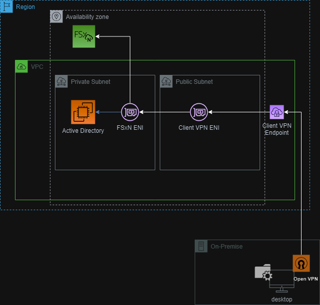
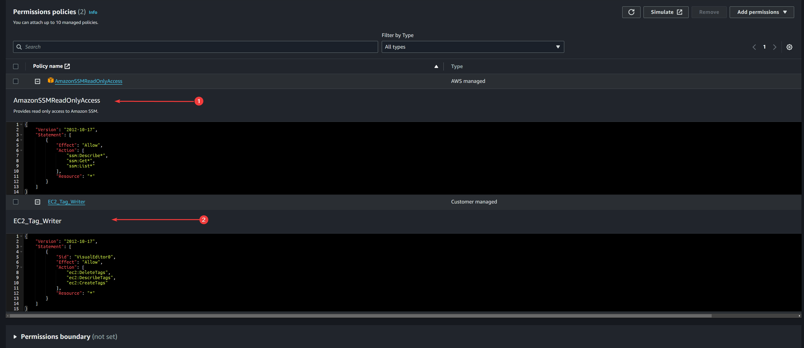
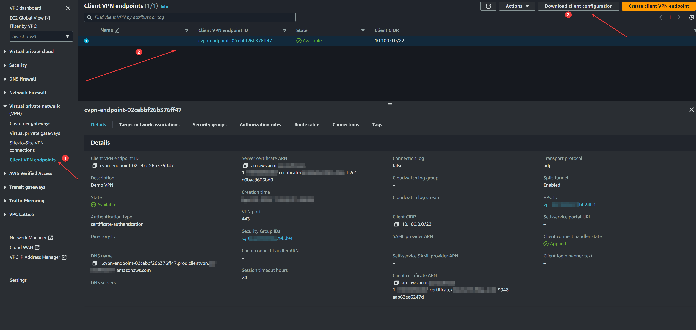
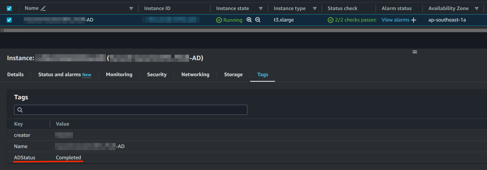
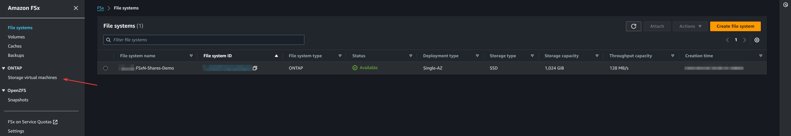
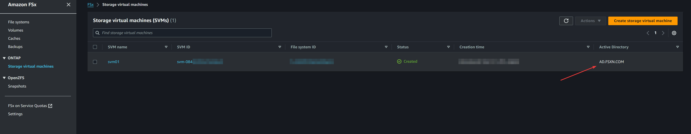
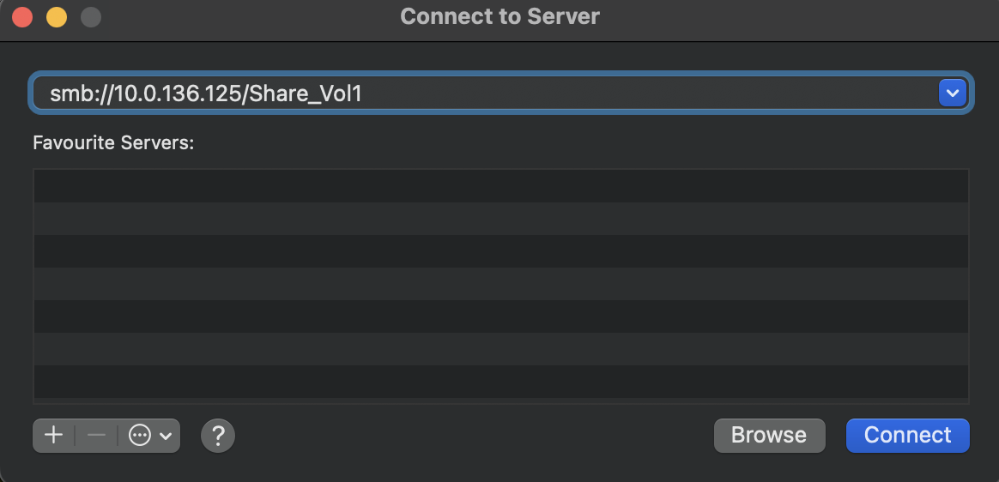

# Deploy an Amazon FSx for NetApp ONTAP with VPN

The sample terraform deployment will create a Amazon FSx for NetApp ONTAP filesystem, AD, VPN setup, and create shares for quick access to shares to simulate on-prem access.



## Table of Contents

- [Introduction](#introduction)
- [Repository Overview](#repository-overview)
- [Prerequisites](#prerequisites)
- [Usage](#usage)
- [Author Information](#author-information)
- [License](#license)

## Introduction

### Repository Overview

This repository contains the deployment for Amazon FSx for NetApp ONTAP, Microsoft AD, VPN Endpoint, and Jump Server. The following files and modules are part of this deployment.

> [!NOTE]
> The Jump Server configures the filesystem for creating some default shares.
> Besides configuring the shares, the Jump Server can be used for additional configuration for the file system.

#### Terraform Files

| File          | File Path                                | Description                                                                                                                                                                             |
| ------------- | ---------------------------------------- | --------------------------------------------------------------------------------------------------------------------------------------------------------------------------------------- |
| main.tf       | deploy-fsx-ontap-sqlserver/main.tf       | This is the primary terraform file that contains provider information and module configuration for SQL Server EC2 and Amazon FSx for NetApp ONTAP                                       |
| networking.tf | deploy-fsx-ontap-sqlserver/networking.tf | Creates the networking components - VPC, Public and Private Subnets, Internet Gateway, NAT Gateway, Route Table (private and public), Security Groups (default, EC2 to FSxN and others) |
| ssm.tf        | deploy-fsx-ontap-sqlserver/ssm.tf        | Creates an SSM parameter to store the password for the file system                                                                                                                      |
| variables.tf  | deploy-fsx-ontap-sqlserver/variables.tf  | Defines all the variables (and default values) used in main.tf, networking.tf, ssm.tf                                                                                                   |

#### Terraform Modules

| Module | File              | File Path                                                       | Description                                                                                                        |
| ------ | ----------------- | --------------------------------------------------------------- | ------------------------------------------------------------------------------------------------------------------ |
| ec2ad  | ec2-ami.tf        | deploy-fsx-ontap-fileshare-access/modules/ec2/ec2-ami.tf        | The file contains the AMI used for deploying the Microsoft AD                                                      |
| ec2ad  | ec2-ad.tf         | deploy-fsx-ontap-fileshare-access/modules/ec2/ec2-sql.tf        | The file defines the EC2 and script to configure the Microsoft AD                                                  |
| ec2ad  | variables.tf      | deploy-fsx-ontap-fileshare-access/modules/ec2/variables.tf      | Defines all the variables (and default values) used in main.tf and ec2-ad.tf                                       |
| ec2ad  | outputs.tf        | deploy-fsx-ontap-fileshare-access/modules/ec2/outputs.tf        | Defines the output variables for Microsoft AD Server                                                               |
| fsxn   | fsx-fs.tf         | deploy-fsx-ontap-fileshare-access/modules/fsxn/fsx-fs.tf        | Defines the Amazon FSx for NetApp ONTAP file system and it's properties (SSD, Throughput, Deployment Mode etc.)    |
| fsxn   | fsx-svm.tf        | deploy-fsx-ontap-fileshare-access/modules/fsxn/fsx-svm.tf       | Defines the Storage Virtual Machine (SVM) to be created in the file system                                         |
| fsxn   | fsx-volume.tf     | deploy-fsx-ontap-fileshare-access/modules/fsxn/fsx-volume.tf    | Defines the two volumes to be created in the file system under the SVM                                             |
| fsxn   | outputs.tf        | deploy-fsx-ontap-fileshare-access/modules/fsxn/outputs.tf       | Defines the output variables that are used further downstream in the deployment                                    |
| fsxn   | variables.tf      | deploy-fsx-ontap-fileshare-access/modules/fsxn/variables.tf     | Defines all the variables (and default values) used in fsx-fs.tf, fsx-svm.tf, fsx-volume, outputs.tf, variables.tf |
| vpn    | main.tf           | deploy-fsx-ontap-fileshare-access/modules/vpn/main.tf           | Main module for the VPN deployment - create VPN Endpoint, configures certificates, routing and security groups     |
| vpn    | securitygroups.tf | deploy-fsx-ontap-fileshare-access/modules/vpn/securitygroups.tf | Defines the security groups for the VPN Endpoint                                                                   |
| vpn    | variables.tf      | deploy-fsx-ontap-fileshare-access/modules/vpn/variables.tf      | Defines all the variables (and default values) used in main.tf and securitygroups.tf                               |

### Providers

| Name                                                                     | Version  |
| ------------------------------------------------------------------------ | -------- |
| <a name="requirement_terraform"></a> [terraform](#requirement_terraform) | >= 1.6.6 |
| <a name="requirement_aws"></a> [aws](#requirement_aws)                   | >= 5.25  |

### Inputs

| Name                  | Description                                                                                                   | Type           | Default                              | Required |
| --------------------- | ------------------------------------------------------------------------------------------------------------- | -------------- | ------------------------------------ | :------: |
| creator_tag           | Creator Tag assigned for all the resources created                                                            | `string`       |                                      |   Yes    |
| environment           | Name of the environment (demo, test, qa etc.)                                                                 | `string`       | `Demo`                               |    No    |
| aws_location          | AWS region                                                                                                    | `string`       | `ap-southeast-1`                     |   Yes    |
| availability_zones    | Availability Zones corresponding to the regions                                                               | `list(string)` | `"ap-southeast-1", "ap-southeast-2"` |   Yes    |
| ec2_instance_type     | SQL Server EC2 instance type                                                                                  | `string`       | `t3.2xlarge`                         |   Yes    |
| ec2_instance_keypair  | EC2 Key Pair to be assigned for the deployed EC2 instance                                                     | `string`       |                                      |   Yes    |
| ec2_iam_role          | IAM Role assigned to the EC2 (see section)[#create-an-iam-role-and-attach-the-policy-amazonssmreadonlyaccess] | `string`       |                                      |   Yes    |
| fsxn_password         | Password for the fsxadmin user assigned to the filesystem                                                     | `string`       |                                      |   Yes    |
| volume_security_style | Root Volume and Flex Volume Security Style                                                                    | `string`       | `NTFS`                               |   Yes    |
| vpc_cidr              | CIDR Range for the VPC to be created                                                                          | `string`       | `10.0.0.0/16`                        |   Yes    |
| public_subnets_cidr   | 2 x Public Subnets to be created in the VPC                                                                   | `list(string)` | `"10.0.0.0/20", "10.0.16.0/20"`      |   Yes    |
| private_subnets_cidr  | 2 x Private Subnets to be created in the VPC                                                                  | `list(string)` | `"10.0.128.0/20", "10.0.144.0/20"`   |   Yes    |

### Outputs

| Name                     | Description                          |
| ------------------------ | ------------------------------------ |
| FSxN_management_ip       | FSxN File System Management Endpoint |
| FSxN_svm_iscsi_endpoints | FSxN SVM iSCSI IP addresses          |
| FSxN_sql_server_ip       | SQL Server EC2 IP addresses          |
| FSxN_file_system_id      | FSxN File System Id                  |
| FSxN_svm_id              | FSxN Storage Virtual Machine Id      |
| FSxN_sql_data_volume     | FSxN SQL Data Volume Id and Name     |
| FSxN_sql_log_volume      | FSxN SQL Log Volume Id and Name      |

### What to expect

The terraform deployment creates the following components:

- VPC with 2 Public and 2 Private Subnets
- Internet Gateway
- NAT Gateway
- Security Groups for the File System and EC2
- 1 Directory Service or self-managed Active Directory on EC2
  - The active directory configuration will include a Domain setup, Organization Unit (FSxN), a File System Administrators group, and a service account user
- Security Groups for the File System and EC2
- 1 FSxN File System (1 SVM joined to AD and 2 volumes)
- 1 Client VPN Endpoint

## Prerequisites

1. [Terraform prerequisites](#terraform)
2. [AWS prerequisites](#aws-account-setup)

### Terraform

| Name                                                                     | Version  |
| ------------------------------------------------------------------------ | -------- |
| <a name="requirement_terraform"></a> [terraform](#requirement_terraform) | >= 1.6.6 |
| <a name="requirement_aws"></a> [aws](#requirement_aws)                   | >= 5.25  |

### AWS Account Setup

- You must have an AWS Account with necessary permissions to create and manage resources
- Configure your AWS Credentials on the server running this Terraform module. This can be derived from several sources, which are applied in the following order:

  1. Parameters in the provider configuration
  2. Environment variables
  3. Shared credentials files
  4. Shared configuration files
  5. Container credentials
  6. Instance profile credentials and Region

  This order matches the precedence used by the [AWS CLI](https://docs.aws.amazon.com/cli/latest/userguide/cli-configure-quickstart.html#cli-configure-quickstart-precedence) and the [AWS SDKs](https://aws.amazon.com/tools/).

> [!NOTE]
> In this sample, the AWS Credentials were configured through [AWS CLI](https://aws.amazon.com/cli/), which adds them to a shared configuration file (option 4 above).
> Therefore, this documentation only provides guidance on setting-up the AWS credentials with shared configuration file using AWS CLI.

---

#### Configure AWS Credentials using AWS CLI

The AWS Provider can source credentials and other settings from the shared configuration and credentials files. By default, these files are located at `$HOME/.aws/config` and `$HOME/.aws/credentials` on Linux and macOS, and `"%USERPROFILE%\.aws\credentials"` on Windows.

There are several ways to set your credentials and configuration setting using AWS CLI. We will use [`aws configure`](https://docs.aws.amazon.com/cli/latest/reference/configure/index.html) command:

Run the following command to quickly set and view your credentails, region, and output format. The following example shows sample values:

```shell
 $ aws configure
 AWS Access Key ID [None]: < YOUR-ACCESS-KEY-ID >
 AWS Secret Access Key [None]: < YOUR-SECRET-ACCESS-KE >
 Default region name [None]: < YOUR-PREFERRED-REGION >
 Default output format [None]: json
```

To list configuration data, use the [`aws configire list`](https://docs.aws.amazon.com/cli/latest/reference/configure/list.html) command. This command lists the profile, access key, secret key, and region configuration information used for the specified profile. For each configuration item, it shows the value, where the configuration value was retrieved, and the configuration variable name.

---

#### Create an IAM Role and attach the policy "AmazonSSMReadOnlyAccess"

1. **Navigate to the IAM Service**:

   - In the AWS Management Console, search for "IAM" or find it under "Security, Identity, & Compliance" in the services menu.

2. **Create a Policy**:

   - Create a policy with the following permissions. This policy allows creation of the tags for EC2 instance of Active Directory
   - Select Service 'EC2'
   - Switch to JSON view

     ```json
     {
       "Version": "2012-10-17",
       "Statement": [
         {
           "Sid": "VisualEditor0",
           "Effect": "Allow",
           "Action": ["ec2:DeleteTags", "ec2:DescribeTags", "ec2:CreateTags"],
           "Resource": "*"
         }
       ]
     }
     ```

   - Select Next and save the policy with name "EC2_Tag_Writer"

3. **Create a New IAM Role**:

   - In the IAM dashboard, click on "Roles" in the left navigation pane.
   - Click the "Create role" button.

4. **Select the Service that Will Use the Role**:

   - Under "Select type of trusted entity", choose "AWS service" since you want this role to be used by an AWS service.
   - Under "Choose a use case", select "EC2".

5. **Attach Permissions Policies**:

   - Search for "AmazonSSMReadOnlyAccess" in the policy search box.
   - Select the checkbox next to "AmazonSSMReadOnlyAccess".
   - Attach the policy: Add Permissions -> Attach policies -> Search "EC2_Tag_Writer" -> Select and Add.
     

6. **Review Role Details**:

   - Click "Next: Tags" to skip adding tags (optional).
   - Click "Next: Review" to review the role details.

7. **Name the Role**:

   - Enter a name for your role in the "Role name" field (e.g., `SSMReadOnlyRole`).
   - Optionally, add a description for the role.

8. **Create the Role**:
   - Click the "Create role" button.

> [!NOTE]
> The role is required to fetch the password for fsxadmin from SSM Secured Parameters. Terraform creates an SSM Paramter which is retrieved via the powershell script of EC2 instance. The role allows the retrieval of the parameter and execute the necessary operations on the filesystem.
> Alternatively, the password can also be entered in the `user_data` section under `$ssmPass` variable found in the ec2-sql.tf file (not recommended).

#### Generate VPN Certificates

[Steps to Generate the certificates](./modules/vpn/certs/README.md)

#### AWS Client VPN Setup

Open the Amazon VPC console at https://console.aws.amazon.com/vpc/.

In the navigation pane, choose Client VPN Endpoints.

Select the Client VPN endpoint that you created for this tutorial, and choose Download client configuration.


Locate the client certificate and key that were generated in [the step](#generate-vpn-certificates).

> [!IMPORTANT]
> Note: The default certificates can be found in this repository at Terraform/deploy-fsx-ontap-fileshare-access/modules/vpn/certs
> These certs are pre-generated and should not be used for production deployment.
> You may want to generate your own certificates for use with this setup and assign the path in main.tf under vpn module

```bash
# Sample Cert Files or use your own certificate and private keys
Client certificate — modules/vpn/certs/client.fsxn.crt
Client key — modules/vpn/certs/client.fsxn.key

```

Open the Client VPN endpoint configuration file using your preferred text editor. Add <cert></cert> and <key></key> tags to the file. Place the contents of the client certificate and the contents of the private key between the corresponding tags, as such:

```xml
<cert>
Contents of client certificate (.crt) file
</cert>

<key>
Contents of private key (.key) file
</key>
```

Locate the line that specifies the Client VPN endpoint DNS name, and prepend a random string to it so that the format is random_string.displayed_DNS_name. For example:

```
Original DNS name: cvpn-endpoint-0102bc4c2eEXAMPLE.prod.clientvpn.us-west-2.amazonaws.com

Modified DNS name: asdfa.cvpn-endpoint-0102bc4c2eEXAMPLE.prod.clientvpn.us-west-2.amazonaws.com
```

> [!IMPORTANT]
> Note: We recommend that you always use the DNS name provided for the Client VPN endpoint in your configuration file, as described. The IP addresses that the DNS name will resolve to are subject to change.

Save and close the Client VPN endpoint configuration file.

Distribute the Client VPN endpoint configuration file to your end users or use the configuration file with your OpenVPN Client.

[Reference](https://docs.aws.amazon.com/vpn/latest/clientvpn-admin/cvpn-getting-started.html#cvpn-getting-started-config)

#### Open VPN Client Installation and Configuration

Refer to the documentation for client [installation on windows](https://docs.aws.amazon.com/vpn/latest/clientvpn-user/client-vpn-connect-windows.html)
Refer to the documentation for client [installation on linux](https://docs.aws.amazon.com/vpn/latest/clientvpn-user/client-vpn-connect-linux.html)
Refer to the documentation for client [installation on macos](https://docs.aws.amazon.com/vpn/latest/clientvpn-user/client-vpn-connect-macos.html)

## Usage

#### 1. Clone the repository

In your server's terminal, navigate to the location where you wish to store this Terraform repository, and clone the repository using your preferred authentication type. In this example we are using HTTPS clone:

```shell
git clone https://github.com/NetApp/FSx-ONTAP-samples-scripts
```

#### 2. Navigate to the directory

```shell
cd Terraform/deploy-fsx-ontap-fileshare-acess
```

#### 3. Initialize Terraform

This directory represents a standalone Terraform module. Run the following command to initialize the module and install all dependencies:

```shell
terraform init
```

A succesfull initialization should display the following output:

```shell

Initializing the backend...
Initializing modules...

Initializing provider plugins...
- Reusing previous version of hashicorp/local from the dependency lock file
- Reusing previous version of hashicorp/aws from the dependency lock file
- Using previously-installed hashicorp/local v2.5.1
- Using previously-installed hashicorp/aws v5.25.0

Terraform has been successfully initialized!

You may now begin working with Terraform. Try running "terraform plan" to see
any changes that are required for your infrastructure. All Terraform commands
should now work.

If you ever set or change modules or backend configuration for Terraform,
rerun this command to reinitialize your working directory. If you forget, other
commands will detect it and remind you to do so if necessary.

```

You can see that Terraform recognizes the modules required by our configuration: `hashicorp/aws`.

#### 4. Create Variables Values

- Copy or Rename the file **`terraform.sample.tfvars`** to **`terraform.tfvars`**

- Open the **`terraform.tfvars`** file in your preferred text editor. Update the values of the variables to match your preferences and save the file. This will ensure that the Terraform code deploys resources according to your specifications.

- Set the parameters in terraform.tfvars

  ##### Sample file

  ***

  ```ini
    creator_tag           = "<Creator Tag>"
    environment           = "Demo"
    aws_location          = "<AWS Region>"
    availability_zones    = ["<Availability Zone 1>", "<Availability Zone 2>"]
    ec2_instance_type     = "t3.2xlarge"
    ec2_instance_keypair  = "<EC2 Instance Key Pair>"
    ec2_iam_role          = "<IAM Role>"
    fsxn_password         = "<Password for fsxadmin>"
    volume_security_style = "NTFS"
    vpc_cidr              = "10.0.0.0/16"
    public_subnets_cidr   = ["10.0.0.0/20", "10.0.16.0/20"]
    private_subnets_cidr  = ["10.0.128.0/20", "10.0.144.0/20"]
  ```

> [!IMPORTANT] > **Make sure to replace the values with ones that match your AWS environment and needs.**

#### 5. Create a Terraform plan

Run the following command to create an execution plan, which lets you preview the changes that Terraform plans to make to your infrastructure:

```shell
terraform plan
```

Ensure that the proposed changes match what you expected before you apply the changes!

#### 6. Apply the Terraform plan

Run the following command to execute the Terrafom code and apply the changes proposed in the `plan` step:

```shell
terraform apply
```

##### Post Deployment

- Validate Self-Hosted AD Deployment - Check the "ADStatus" tag of the EC2 instance deployed. The tag status will automatically be set to "Completed" upon successful deployment and configuration of the Active Directory Server.
  
- Validate Amazon FSx for NetApp ONTAP is configured with the Active Directory - Access Amazon FSx from AWS Management Console and select "Storage Virtual Machines". Under the SVM created, it should indicate the domain name (check screenshot below)
  
  
- Follow the steps to [configure the VPN Client](#aws-client-vpn-setup)
- Follow for [Installation and Configuration of OpenVPN client](#open-vpn-client-installation-and-configuration)
  - Use the downloaded configuration when setting up the OpenVPN client
- Connect to the VPN via OpenVPN Client and access the file shares using the SVM IP address
  - On Windows Client, open command prompt and enter the following command
  ```powershell
      # Replace the IP Address with SVM SMB IP Address
      net use \\10.0.136.125\Share_Vol1 /u:ad\fsxnadmin
  ```
  - On MacOS, open Finder, select "Go -> Connect to Server" from the menu and enter the path as shown below and Connect.
    
  - Enter the username "AD\fsxnadmin" and password

## Author Information

This repository is maintained by the contributors listed on [GitHub](https://github.com/NetApp/FSx-ONTAP-samples-scripts/graphs/contributors).

## License

Licensed under the Apache License, Version 2.0 (the "License").

You may obtain a copy of the License at [apache.org/licenses/LICENSE-2.0](http://www.apache.org/licenses/LICENSE-2.0).

Unless required by applicable law or agreed to in writing, software distributed under the License is distributed on an _"AS IS"_ basis, without WARRANTIES or conditions of any kind, either express or implied.

See the License for the specific language governing permissions and limitations under the License.

<!-- END_TF_DOCS -->

> [!IMPORTANT]
> This sample deployment is not meant for production use.

© 2024 NetApp, Inc. All Rights Reserved.
